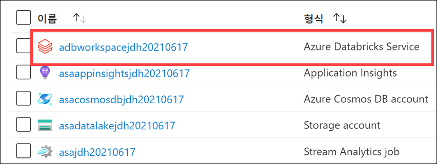
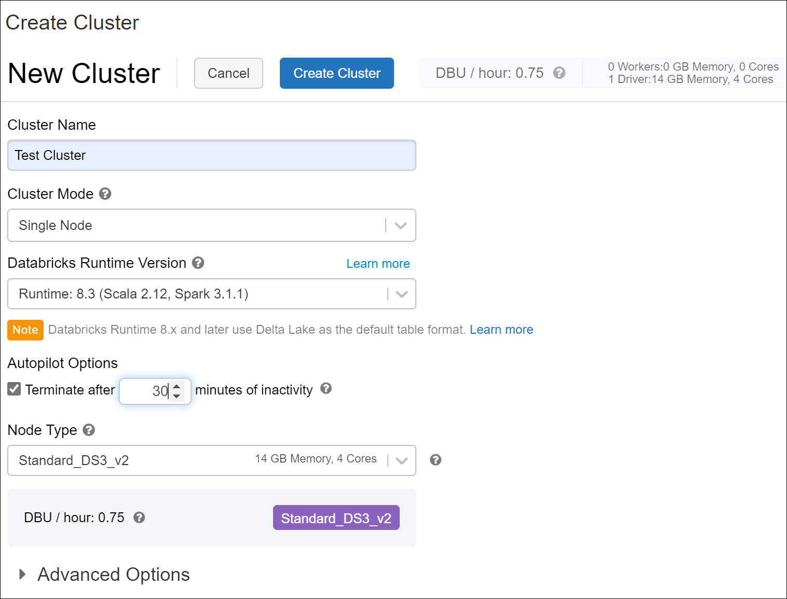
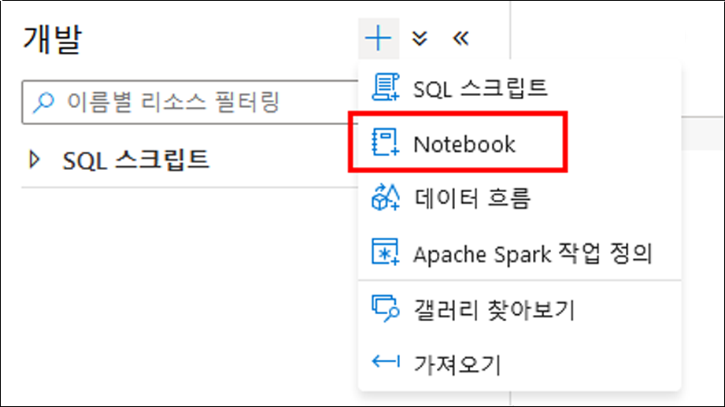
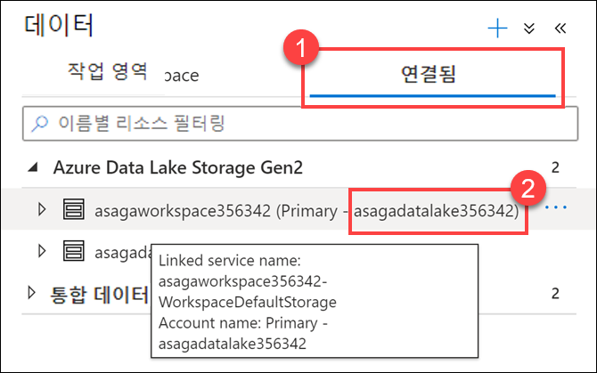
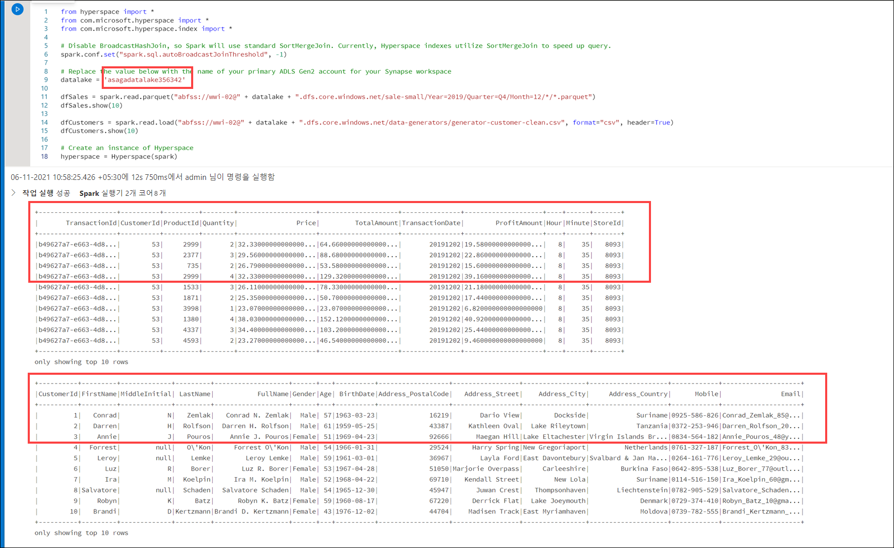
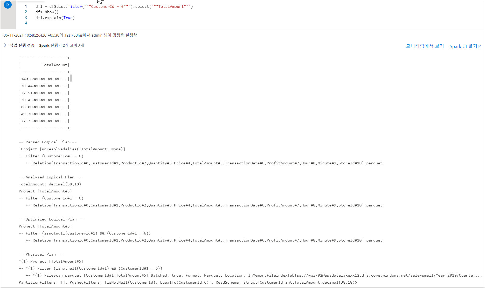
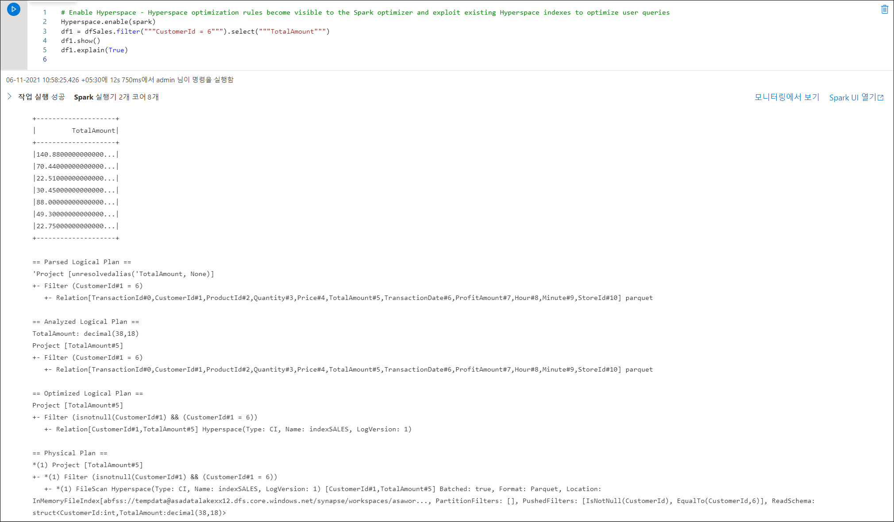
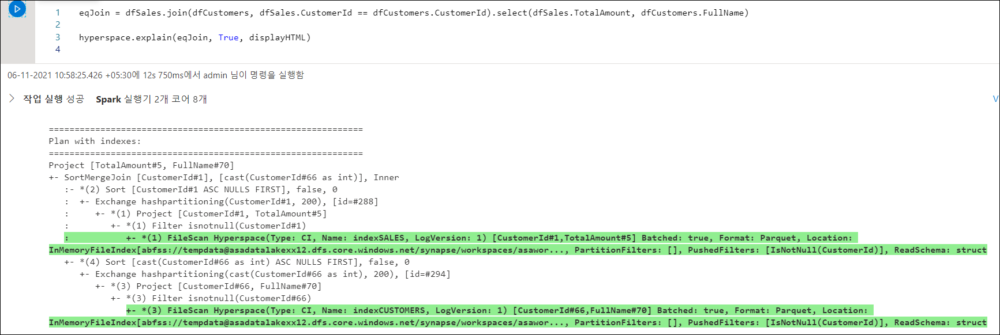

---
lab:
    title: '데이터 엔지니어링 워크로드용 컴퓨팅 및 스토리지 옵션 살펴보기'
    module: '모듈 1'
---

# 랩 1 - 데이터 엔지니어링 워크로드용 컴퓨팅 및 스토리지 옵션 살펴보기

이 랩에서는 데이터 레이크의 구조를 지정하는 방법과 탐색, 스트리밍 및 일괄 처리 워크로드용 파일을 최적화하는 방법을 살펴봅니다. 구체적으로는 일괄 처리 및 스트림 처리를 통해 파일을 변환하는 과정에서 데이터 레이크를 데이터 구체화 수준으로 구성하는 방법을 알아봅니다. 또한 CSV, JSON, Parquet 파일 등의 데이터 세트에서 인덱스를 만든 다음 발생 가능한 쿼리 및 워크로드 가속화에 해당 인덱스를 사용하는 방법도 알아봅니다.

이 랩을 마치면 다음과 같은 역량을 갖추게 됩니다.

- 단일 파이프라인을 사용하여 스트리밍과 일괄 처리를 함께 수행
- 데이터 레이크를 파일 변환 수준으로 구성
- 쿼리 및 워크로드 가속화를 위해 데이터 레이크 스토리지 인덱싱

## 랩 설정 및 필수 구성 요소

이 랩을 시작하기 전에 랩 환경을 만드는 설정 단계를 성공적으로 완료했는지 확인하세요.

## 연습 1 - Delta Lake 아키텍처

이 연습에서는 Azure Databricks 작업 영역을 사용해 보고, Delta Lake를 사용하여 일괄 작업을 통해 구조적 스트리밍을 수행합니다. 연습은 Databricks Notebook 내에서 완료해야 합니다. 시작하려면 Azure Databricks 작업 영역에 대한 액세스 권한이 있어야 합니다.

### 작업 1: Azure Databricks 클러스터 만들기

1. Azure Portal(`https://portal.azure.com`)에 로그인하고 이 과정의 설정 스크립트를 통해 만들어진 **data-engineering-synapse-*xxxxxxx*** 리소스 그룹으로 이동합니다. 그런 다음에 Azure Databricks Service 작업 영역을 선택합니다.

    

2. **작업 영역 시작**을 선택하여 새 탭에서 Databricks 작업 영역을 엽니다.

    

3. Databricks 작업 영역의 왼쪽 메뉴에서 **컴퓨팅**을 선택합니다.
4. **+클러스터 만들기**를 선택하여 새 클러스터를 추가합니다.

    

5. 클러스터의 이름을 입력합니다(예: `Test Cluster`).
6. **단일 노드** 클러스터 모드를 선택합니다.
7. **Databricks RuntimeVersion**을 선택합니다. 최신 런타임 및 **Scala 2.12**를 선택하는 것이 좋습니다.
8. **다음 시간 이후에 종료** 제한 시간을 30분으로 설정하고 기본 노드 유형을 선택합니다.
9. **클러스터 만들기**를 선택합니다.
10. 클러스터가 시작될 때까지 기다립니다. 클러스터가 시작될 때까지 5~7분 기다렸다가 다음 작업으로 넘어가야 합니다.

### 작업 2: Databricks 보관 파일 복제

1. Azure Databricks 작업 영역의 왼쪽 창에서 **작업 영역** > **사용자**를 선택하고, 사용자 이름(집 모양 아이콘이 있는 항목)을 선택합니다.
1. 표시되는 창에서 이름 옆에 있는 화살표를 선택한 다음 **가져오기**를 선택합니다.

    

1. **Notebook 가져오기** 대화 상자에서 URL을 선택하고, 다음 URL에 붙여넣습니다.

    ```
    https://github.com/MicrosoftLearning/DP-203-Data-Engineer/raw/master/Allfiles/microsoft-learning-paths-databricks-notebooks/data-engineering/DBC/11-Delta-Lake-Architecture.dbc
    ```

1. **가져오기**를 선택합니다.
1. 표시되는 **11-Delta-Lake-Architecture** 폴더를 선택합니다.

### 작업 3: *1-Delta-Architecture* Notebook에서 코드 실행

1. **1-Delta-Architecture** Notebook을 엽니다.
1. 지침에 따라 그 안에 들어 있는 셀을 실행하기 전에 클러스터를 Notebook에 연결합니다. 코드 셀을 실행하려면 실행할 셀을 선택하고 오른쪽 상단의 **&#x23f5;** 단추를 사용하여 셀을 실행합니다.

    Notebook에서는 단일 파이프라인으로 스트리밍과 일괄 처리를 결합하는 방법을 살펴봅니다.

## 중요: 클러스터 종료

1. Azure Databricks Notebook을 살펴보는 것을 마친 후에는 Azure Databricks 작업 영역의 왼쪽 창에서 **컴퓨팅**을 선택하고 클러스터를 선택합니다. 그런 다음에 **종료**를 선택하여 클러스터를 종료합니다.

## 연습 2 - Synapse Analytics에서 Apache Spark 사용

이 연습에서는 Azure Synapse Analytics에서 Apache Spark를 사용하는 환경을 살펴봅니다. 그리고 Hyperspace, MSSparkUtil 등의 라이브러리를 사용하여 Spark Notebooks에서 Data Lake 스토리지 계정 사용 환경을 최적화하는 방법도 알아봅니다.

연습을 완료하면 Azure Synapse Analytics 작업 영역에서 Spark 라이브러리를 로드하고 사용하는 방법을 이해하게 됩니다.

### 작업 1: Hyperspace를 사용하여 Data Lake 스토리지 인덱싱

Azure Data Lake Gen 2에서 데이터를 로드할 때 리소스를 가장 많이 사용하는 작업 중 하나는 데이터 검색입니다. Apache Spark 사용자는 [Hyperspace](https://github.com/microsoft/hyperspace)의 기능을 사용해 CSV, JSON, Parquet 파일 등의 데이터 세트에서 인덱스를 만든 다음 발생 가능한 쿼리 및 워크로드 가속화에 해당 인덱스를 사용할 수 있습니다.

Hyperspace를 사용하면 지속형 데이터 파일에서 스캔한 레코드의 인덱스를 만들 수 있습니다. 인덱스를 만들고 나면 인덱스에 해당하는 항목이 Hyperspace 메타데이터에 추가됩니다. 그러면 나중에 Apache Spark의 최적화 프로그램이 쿼리를 처리할 때 이 메타데이터를 사용하여 적절한 인덱스를 찾고 사용하게 됩니다. 기본 데이터가 변경되면 기존 인덱스를 새로 고쳐 변경 내용을 캡처할 수 있습니다.

또한 Hyperspace를 사용하는 경우 쿼리를 실행하기 전에 원래 계획과 업데이트된 인덱스 종속 계획을 비교할 수 있습니다.

1. Synapse Studio(`https://web.azuresynapse.net`)를 열고, 관련 메시지가 나타나면 Azure Active Directory 테넌트, 구독 및 Azure Synapse Analytics 작업 영역을 선택합니다. "더 나은 경험을 제공하기 위해 선택 사항인 쿠키를 사용합니다" 메시지가 나타나면 수락을 선택합니다.

2. **개발** 허브를 선택합니다.

    

3. **+**, **Notebook**을 차례로 선택하여 새 Synapse Notebook을 만듭니다.

    

4. Notebook 이름으로 **Hyperspace**를 입력하고 **(1)** 위쪽의 **속성** 단추 **(2)** 를 선택하여 속성 창을 숨깁니다.

    

5. Notebook을 **SparkPool01**에 연결하고 언어가 **PySpark(Python)** 로 설정되어 있는지 확인합니다.

    

6. Notebook의 새 셀에 다음 코드를 추가합니다.

```python
from hyperspace import *  
from com.microsoft.hyperspace import *
from com.microsoft.hyperspace.index import *

# Disable BroadcastHashJoin, so Spark will use standard SortMergeJoin. Currently, Hyperspace indexes utilize SortMergeJoin to speed up query.
spark.conf.set("spark.sql.autoBroadcastJoinThreshold", -1)

# Replace the value below with the name of your primary ADLS Gen2 account for your Synapse workspace
datalake = 'asadatalakeSUFFIX'

dfSales = spark.read.parquet("abfss://wwi-02@" + datalake + ".dfs.core.windows.net/sale-small/Year=2019/Quarter=Q4/Month=12/*/*.parquet")
dfSales.show(10)

dfCustomers = spark.read.load("abfss://wwi-02@" + datalake + ".dfs.core.windows.net/data-generators/generator-customer-clean.csv", format="csv", header=True)
dfCustomers.show(10)

# Create an instance of Hyperspace
hyperspace = Hyperspace(spark)
```

7. **datalake** 변수 값에서 ***SUFFIX***를 고유한 리소스 이름 확장명으로 바꿉니다. 그러면 변수가 Azure Data Lake 스토리지 계정의 이름을 나타냅니다(**asadatalake*xxxxxx***이어야 함).

    >    이를 확인하기 위해 다음을 수행합니다.
    >
    >    1. **데이터** 허브로 이동합니다.
    >
    >        
    >
    >    1. **연결됨** 탭 **(1)** 을 선택하고 Azure Data Lake Storage Gen2 그룹을 확장한 다음 작업 영역 이름 옆의 기본 ADLS Gen2 이름 **(2)** 을 적어 둡니다.
    >
    >        

8. 왼쪽의 **&#9655;** 단추를 사용하거나 **Shift+Enter**를 눌러 수정된 코드 셀을 실행합니다. 그러면 데이터 레이크의 데이터가 포함된 데이터 프레임 2개가 로드되고 Hyperspace가 초기화됩니다.

    

    > **참고**: Notebook에서 셀을 처음 실행하면 새 Spark 클러스터를 시작해야 하므로 셀을 실행하는 데 몇 분 정도 걸립니다. 그 이후에 각 셀을 실행할 때는 속도가 훨씬 빨라집니다.

9. 셀 출력 아래의 **+ 코드** 단추를 선택하여 새 코드 셀을 만듭니다.

10. 다음 코드를 새 셀에 붙여넣습니다.

```python
#create indexes: each one contains a name, a set of indexed columns and a set of included columns
indexConfigSales = IndexConfig("indexSALES", ["CustomerId"], ["TotalAmount"])
indexConfigCustomers = IndexConfig("indexCUSTOMERS", ["CustomerId"], ["FullName"])

hyperspace.createIndex(dfSales, indexConfigSales)			# only create index once
hyperspace.createIndex(dfCustomers, indexConfigCustomers)	# only create index once
hyperspace.indexes().show()
```

11. 새 셀을 실행합니다. 그러면 인덱스 2개가 작성되고 인덱스의 구조가 표시됩니다.

    

12. 다음 코드를 사용하여 Notebook에 새 코드 셀을 하나 더 추가합니다.

```python
df1 = dfSales.filter("""CustomerId = 6""").select("""TotalAmount""")
df1.show()
df1.explain(True)
```

13. 새 셀을 실행합니다. 출력에는 실제 실행 계획이 인덱스를 고려하지 않는다는 내용이 표시됩니다(원래 데이터 파일에서 파일 검사를 수행함).

    

14. 이제 다음 코드를 사용하여 Notebook에 새 셀을 하나 더 추가합니다(Spark 엔진에서 Hyperspace 최적화를 사용하도록 설정하기 위해 시작 부분에 추가 줄이 사용됨).

```python
# Enable Hyperspace - Hyperspace optimization rules become visible to the Spark optimizer and exploit existing Hyperspace indexes to optimize user queries
Hyperspace.enable(spark)
df1 = dfSales.filter("""CustomerId = 6""").select("""TotalAmount""")
df1.show()
df1.explain(True)
```

15. 새 셀을 실행합니다. 출력에는 이제 실제 실행 계획이 원래 데이터 파일 대신 인덱스를 사용한다는 내용이 표시됩니다.

    

16. Hyperspace에서 제공하는 Explain API를 사용하면 인덱스를 사용하지 않는 경우와 사용하는 경우의 실행 계획을 비교할 수 있습니다. 다음 코드를 사용하여 새 셀을 추가합니다.

```python
df1 = dfSales.filter("""CustomerId = 6""").select("""TotalAmount""")

spark.conf.set("spark.hyperspace.explain.displayMode", "html")
hyperspace.explain(df1, True, displayHTML)
```

17. 새 셀을 실행합니다. 출력에는 `Plan with indexes`과 `Plan without indexes`을 비교한 내용이 표시됩니다. 인덱스 파일이 사용된 첫 번째 경우와 원래 데이터 파일이 사용된 두 번째 경우를 비교하여 살펴봅니다.

    

18. 이제 조인 작업이 포함된 더 복잡한 사례를 살펴보겠습니다. 다음 코드를 사용하여 새 셀을 추가합니다.

```python
eqJoin = dfSales.join(dfCustomers, dfSales.CustomerId == dfCustomers.CustomerId).select(dfSales.TotalAmount, dfCustomers.FullName)

hyperspace.explain(eqJoin, True, displayHTML)
```

19. 새 셀을 실행합니다. 이번에도 출력에는 `Plan with indexes`과 `Plan without indexes`을 비교한 내용이 표시됩니다. 앞에서와 마찬가지로 첫 번째 경우에는 인덱스가 사용되었고 두 번째 경우에는 원래 데이터 파일이 사용되었습니다.

    

20. Hyperspace를 비활성화하고 인덱스를 정리하려면 다음 코드를 사용하여 새 셀을 추가하고 실행합니다.

```python
# Disable Hyperspace - Hyperspace rules no longer apply during query optimization. Disabling Hyperspace has no impact on created indexes because they remain intact
Hyperspace.disable(spark)

hyperspace.deleteIndex("indexSALES")
hyperspace.vacuumIndex("indexSALES")
hyperspace.deleteIndex("indexCUSTOMERS")
hyperspace.vacuumIndex("indexCUSTOMERS")
```

### 작업 2: MSSparkUtil 라이브러리를 사용하여 Data Lake 스토리지 살펴보기

Microsoft Spark Utilities(MSSparkUtils)는 일반적인 작업을 쉽게 수행하기 위해 사용할 수 있는 기본 제공 패키지입니다. MSSparkUtils를 활용하면 파일 시스템과 비밀을 사용하고 환경 변수를 가져올 수 있습니다.

1. 이전 작업에서 사용한 것과 같은 Notebook을 계속 사용하여 다음 코드를 입력해 새 셀을 추가합니다.

```python
from notebookutils import mssparkutils

#
# Microsoft Spark Utilities
#
# https://docs.microsoft.com/en-us/azure/synapse-analytics/spark/microsoft-spark-utilities?pivots=programming-language-python
#

# Azure storage access info
blob_account_name = datalake
blob_container_name = 'wwi-02'
blob_relative_path = '/'
linkedServiceName = datalake
blob_sas_token = mssparkutils.credentials.getConnectionStringOrCreds(linkedServiceName)

# Allow SPARK to access from Blob remotely
spark.conf.set('fs.azure.sas.%s.%s.blob.core.windows.net' % (blob_container_name, blob_account_name), blob_sas_token)

files = mssparkutils.fs.ls('/')
for file in files:
    print(file.name, file.isDir, file.isFile, file.path, file.size)

mssparkutils.fs.mkdirs('/SomeNewFolder')

files = mssparkutils.fs.ls('/')
for file in files:
    print(file.name, file.isDir, file.isFile, file.path, file.size)
```

2. 새 셀을 실행하고 MSSparkUtils를 통해 파일 시스템을 사용하는 방법을 살펴봅니다.

### 작업 3 세션 중지

1. Notebook의 오른쪽 상단에서 **세션 중지** 단추를 사용하여 Notebook 세션을 중지합니다.
1. 나중에 다시 검토하려면 Notebook을 게시합니다. 그런 다음에 닫습니다.

## 리소스

이 랩에서 다룬 토픽에 대해 자세히 알아보려면 다음 리소스를 참조하세요.

- [Azure Synapse Analytics의 Apache Spark](https://docs.microsoft.com/azure/synapse-analytics/spark/apache-spark-overview)
- [Azure Synapse용 Azure Data Explorer 데이터 커넥터 발표](https://techcommunity.microsoft.com/t5/azure-data-explorer/announcing-azure-data-explorer-data-connector-for-azure-synapse/ba-p/1743868)
- [Azure Synapse Analytics용 Apache Spark를 사용하여 Azure Data Explorer에 연결](https://docs.microsoft.com/azure/synapse-analytics/quickstart-connect-azure-data-explorer)
- [Azure Synapse Analytics 공유 메타데이터](https://docs.microsoft.com/azure/synapse-analytics/metadata/overview)
- [Microsoft Spark Utilities 소개](https://docs.microsoft.com/azure/synapse-analytics/spark/microsoft-spark-utilities?pivots=programming-language-python)
- [Hyperspace - Apache Spark™ 및 빅 데이터 워크로드용 인덱스 기반 쿼리 가속화 기능을 제공하는 오픈 소스 인덱싱 하위 시스템](https://github.com/microsoft/hyperspace)
